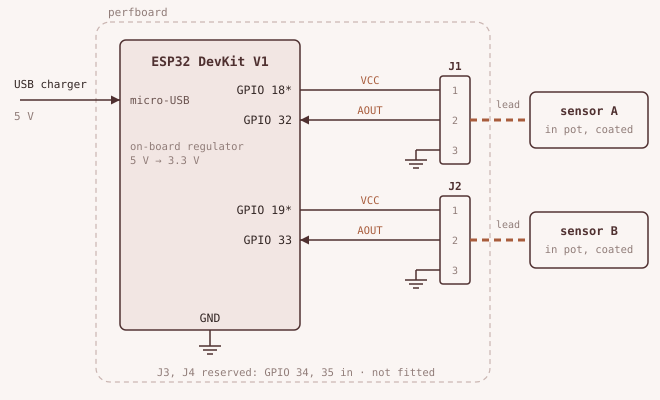

# water

Soil moisture monitoring for houseplants. Each plant gets a capacitive sensor, an ESP32 reads it, and the readings end up on a phone.

This is a first-year EEE learning project. Each design decision is backed by a measurement, a calculation or a source, and the docs say which. Failed attempts stay in the docs.



## Status

| Part | State |
|---|---|
| Sensor characterization | Done for sensor A, sensor B only measured with the multimeter |
| Breadboard node, one sensor | Running, logs every 30 min and serves CSV over Wi-Fi |
| Node v1 (perfboard, two sensors) | Designed, not built |
| Home Assistant on a Raspberry Pi | Chosen, not set up |
| Enclosure | Not started |

## How it works

```
soil water → capacitance → sensor (TL555I) → 1.0–2.7 V → ESP32 ADC1, 12-bit
           → 64-sample average → Wi-Fi → MQTT (planned) → Home Assistant → phone
```

Water has a dielectric constant of about 80, and dry soil 2 to 5. Wetter soil raises the sensor's capacitance. On these boards the output voltage drops as the soil gets wetter.

## Measured so far

| What | Result |
|---|---|
| Sensor output, air and water | 2.70 V and 1.00 V (multimeter) |
| Bone-dry and overwatered soil | 2.66 V and 1.09 V, about 92% of the air-to-water range |
| ADC noise, single samples | Spread of 74 counts |
| ADC noise, 64-sample average | Spread of 4 counts |
| Sensor A vs sensor B | Within 0.01 V in air and water (multimeter) |
| Laptop USB vs phone charger | No difference on the multimeter |
| Window open vs closed | 3 to 5 counts, inside the noise |
| Drying after overwatering | 55 counts per day, slowing to 24 over 6 days |

Raw numbers are in [`data/`](data/). Write-ups are in [`docs/experiments/`](docs/experiments/).

## Repo

| Folder | Contents |
|---|---|
| [`docs/`](docs/) | Logbook, decisions, experiments, problems, open questions, style guide |
| [`firmware/`](firmware/) | The sketch on the node, and the stages it was built in |
| [`hardware/`](hardware/) | Schematic and parts list |
| [`data/`](data/) | Raw readings and calibration points |

## Hardware

- ESP32 WROOM-32 DevKit V1
- Capacitive soil moisture sensor with TL555I and 662K regulator
- Perfboard (planned)
- USB power

Parts and prices are in [`hardware/bom.md`](hardware/bom.md).
